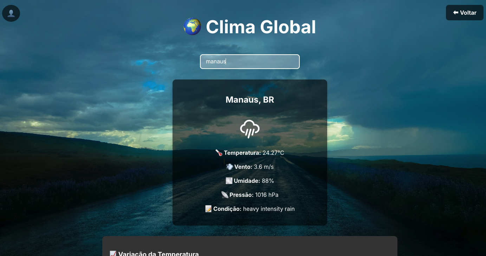

# QuantumBoard 🚀

**QuantumBoard** é uma plataforma moderna e interativa de dashboards que permite aos usuários visualizar dados financeiros, esportivos, meteorológicos e estatísticos de diferentes países. Criado com **React**, **Node.js** e **MongoDB**, este projeto faz uso de APIs públicas para fornecer informações em tempo real.



---

## 🌟 **Funcionalidades Principais**

✅ **Autenticação Segura** - Registro e login com verificação de e-mail via código.  
✅ **Dashboards Temáticos** - Visualização dinâmica de dados de diferentes setores.  
✅ **Interface Moderna e Responsiva** - Design clean, compatível com desktop e mobile.  
✅ **Integração com APIs** - Dados atualizados em tempo real a partir de fontes confiáveis.  
✅ **Modo Seguro** - Proteção contra acessos não autorizados via JWT.

---

## 🔧 **Tecnologias Utilizadas**

### **Frontend**

-   ⚛ **React.js** (Vite)
-   🎨 **Styled Components / CSS Modules**
-   📊 **Recharts** (Gráficos)
-   🌐 **React Router DOM**
-   ⚡ **Axios** (Consumo de APIs)
-   🏗 **Vite.js** (Otimização do Build)

### **Backend**

-   🛠 **Node.js + Express**
-   🔒 **JWT (JSON Web Token)**
-   🗄 **MongoDB (Atlas)**
-   ✉ **Nodemailer** (Envio de E-mails)
-   🔄 **Bcrypt.js** (Criptografia de Senhas)

---

## 🚀 **Como Rodar o Projeto Localmente**

### **Pré-requisitos**

-   Node.js **v18+**
-   MongoDB **Atlas** (ou servidor local)
-   Gerenciador de pacotes **npm** ou **yarn**

### **Passo 1 - Clonar o repositório**

```bash
git clone https://github.com/RenatoFerreiraFilho/dashboard-analise-dados.git
cd QuantumBoard
```

### **Passo 2 - Configurar variáveis de ambiente**

Crie um arquivo `.env` dentro da pasta `backend/` e adicione:

```env
MONGO_URI=sua_string_de_conexao_mongodb
PORT=porta_escolhida_servidor
JWT_SECRET=sua_chave_secreta
EMAIL_USER=seu_email
EMAIL_PASS=sua_senha_de_app
```

Crie um arquivo `.env.local` dentro da pasta `frontend/` e adicione:

```env
VITE_WEATHER_API_KEY=sua_chave
VITE_SPORTS_API_KEY=sua_chave
VITE_API_BASE_URL=http://localhost:[sua_porta]
```

### **Passo 3 - Instalar dependências**

#### Backend

```bash
cd backend
npm install
npm start
```

#### Frontend

```bash
cd frontend
npm install
npm run dev
```

### **Passo 4 - Acesse no navegador**

```
http://localhost:[sua_porta]
```

---

## 📡 **APIs Utilizadas**

-   **[Exchange Rate API](https://www.exchangerate-api.com/)**
-   **[The Sports DB](https://www.thesportsdb.com/)**
-   **[OpenWeather API](https://openweathermap.org/api)**
-   **[RestCountries](https://restcountries.com/)**

---

## 🛡 **Segurança**

🔒 Senhas são armazenadas criptografadas com `bcrypt`.  
📧 O sistema de verificação de e-mails garante que apenas usuários válidos possam acessar a plataforma.  
🔑 Autenticação com `JWT` para proteger as rotas.

---

## 👨‍💻 **Contribuição**

1. Faça um Fork do repositório
2. Crie uma branch (`git checkout -b feature-nova`)
3. Faça suas alterações e commits (`git commit -m "Adiciona nova funcionalidade"`)
4. Envie para o repositório remoto (`git push origin feature-nova`)
5. Abra um **Pull Request**

---

## 💡 **Autor**

👋 Criado por **Renato Ferreira**  
📧 Contato: [renatoaferreirafilho@gmail.com](mailto:renatoaferreirafilho@gmail.com)  
💼 LinkedIn: [linkedin.com/in/renato-ferreira-fullstack](https://linkedin.com/in/ferreira-filho-renato)

---

### **📢 Se gostou do projeto, deixe uma ⭐ e contribua!**
